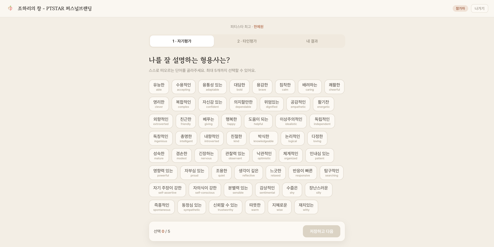
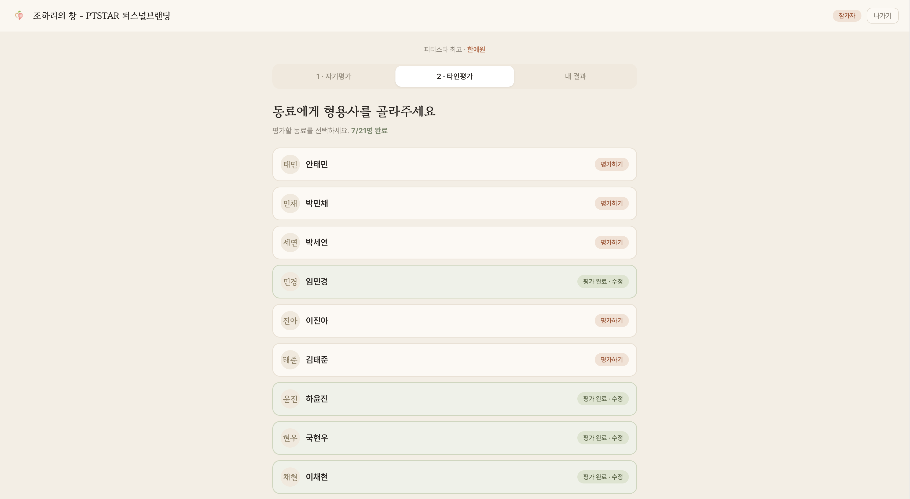
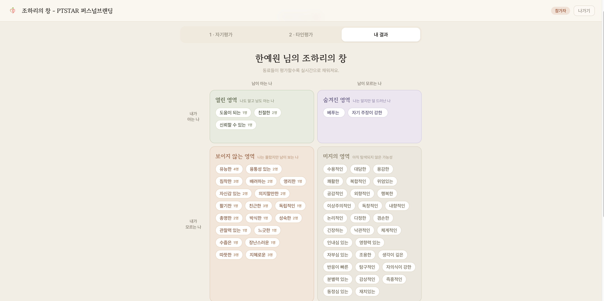

# 조하리의 창 - PTSTAR 퍼스널브랜딩

## 📋 프로젝트 소개
조하리의 창(Johari Window)은 자기 인식과 대인관계 개선을 위한 심리학적 도구입니다.  
[PTSTAR 퍼스널브랜딩 커리큘럼](https://ptstar.netlify.app/johari-window.dc)의 일환으로 개발된 웹 애플리케이션입니다.

## 🎯 주요 기능
- 50개 형용사 중 5개 선택을 통한 자기 평가
- 타인 평가 수집 및 비교 분석
- 4가지 영역으로 구분된 결과 시각화
  - **열린 영역**: 나도 알고 남도 아는 나
  - **숨겨진 영역**: 나는 알지만 남은 모르는 나
  - **맹목 영역**: 남은 알지만 나는 모르는 나
  - **미지 영역**: 나도 모르고 남도 모르는 나

## 📸 스크린샷




## 🛠 기술 스택
- **Frontend**: HTML, CSS, JavaScript
- **Database**: Firebase Firestore
- **Hosting**: Netlify / Firebase Hosting

## 📂 프로젝트 구조
```
Johari-window/
├── public/
│   ├── index.html
│   └── uploads/
├── src/
│   ├── Johari-window.dc.html
│   ├── JohariGrid.dc.html
│   └── support.js
└── config/
    ├── firebase.json
    └── firestore.rules
```

## 🚀 시작하기
1. 저장소 클론
```bash
git clone [repository-url]
```

2. Firebase 설정
- Firebase 프로젝트 생성
- Firestore 활성화

3. 배포
```bash
firebase deploy
```

## 💡 사용 방법
1. 이름 입력
2. 자신을 설명하는 형용사 5개 선택
3. 링크 공유로 타인 평가 수집
4. 조하리의 창 결과 확인

## 📝 라이선스
교육 목적 프로젝트

## 🌐 Languages
- [English Version](README-EN.md)
- [한국어 버전](README.md)

---
*PTSTAR 퍼스널브랜딩 프로그램*
